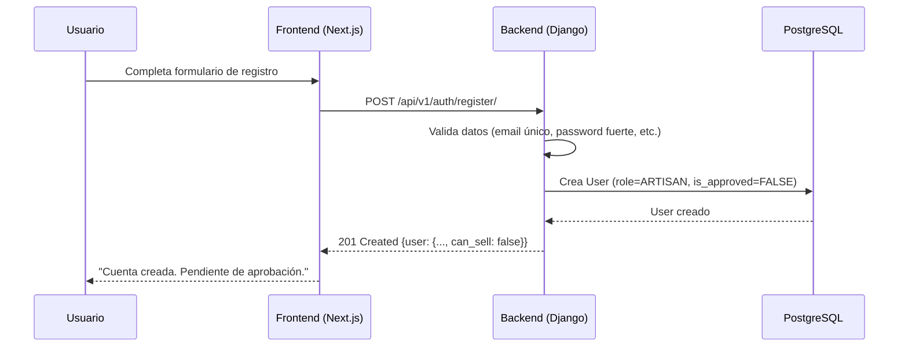
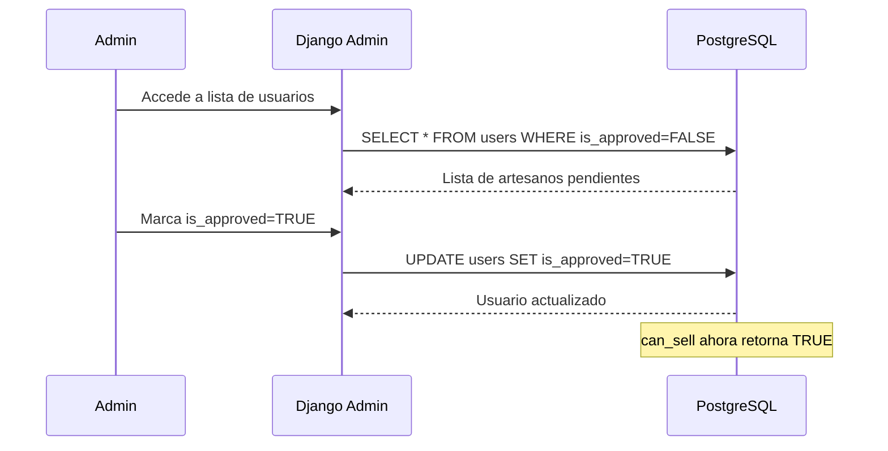
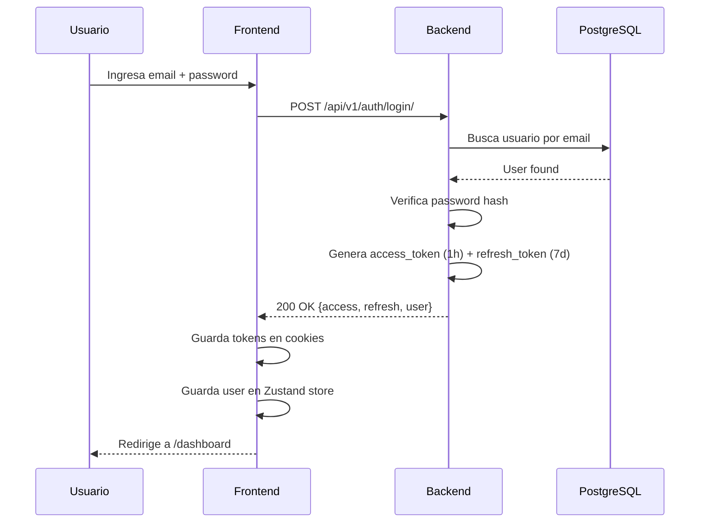
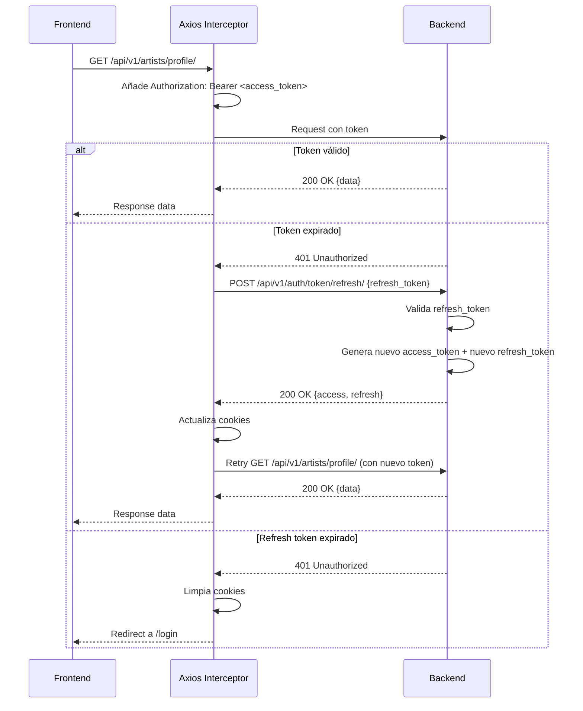
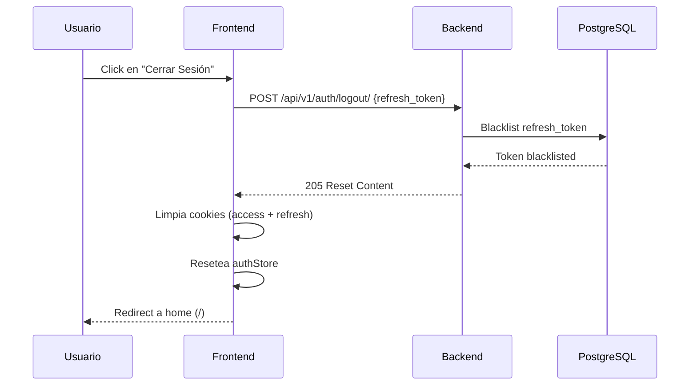

# Sistema de Autenticación - MiTaller.art

> **Estado:** ✅ Implementado y funcional en producción  
> **Stack:** Django 5 + DRF + SimpleJWT + Next.js 15 + Zustand  
> **Última actualización:** Octubre 2025

---

## 📋 Tabla de Contenidos

1. [Resumen Ejecutivo](#resumen-ejecutivo)
2. [Arquitectura General](#arquitectura-general)
3. [Backend (Django + JWT)](#backend-django--jwt)
4. [Frontend (Next.js + Zustand)](#frontend-nextjs--zustand)
5. [Flujo de Autenticación](#flujo-de-autenticación)
6. [Seguridad Implementada](#seguridad-implementada)
7. [Testing y Validación](#testing-y-validación)
8. [Roadmap de Mejoras](#roadmap-de-mejoras)
9. [Referencias](#referencias)

---

## 🎯 Resumen Ejecutivo

MiTaller cuenta con un **sistema completo de autenticación JWT stateless** que permite a los artesanos registrarse, iniciar sesión, y gestionar sus perfiles de manera segura. El sistema está implementado tanto en backend (Django REST Framework) como en frontend (Next.js 15), con las siguientes características principales:

### ✅ Características Implementadas

- **Registro de artesanos** con validaciones robustas
- **Login/Logout** con tokens JWT (access + refresh)
- **Auto-refresh transparente** de tokens expirados
- **Sistema de roles** (Artisan, Admin)
- **Sistema de aprobación** manual de artesanos
- **Protección de rutas** en frontend y backend
- **Persistencia de sesión** con cookies seguras
- **Manejo de errores** con mensajes en español

### 🔑 Métricas del Sistema

| Métrica | Valor |
|---------|-------|
| **Endpoints implementados** | 6 |
| **Access token lifetime** | 1 hora |
| **Refresh token lifetime** | 7 días |
| **Autenticación stateless** | ✅ Sí |
| **Token blacklist** | ✅ Implementado |
| **Password hashing** | PBKDF2 (Django) |

---

## 🏗️ Arquitectura General

```
┌─────────────────────────────────────────────────────────────────┐
│                         CLIENTE (Next.js 15)                    │
├─────────────────────────────────────────────────────────────────┤
│                                                                 │
│  ┌──────────────┐    ┌──────────────┐    ┌─────────────────┐ │
│  │   Pages      │───▶│  authStore   │───▶│   axiosInstance │ │
│  │  /login      │    │   (Zustand)  │    │  (interceptors) │ │
│  │  /registro   │    │              │    │                 │ │
│  │  /dashboard  │    │ - user       │    │ - auto-refresh  │ │
│  └──────────────┘    │ - login()    │    │ - error handle  │ │
│                      │ - logout()   │    └─────────────────┘ │
│                      └──────────────┘                          │
│                             │                                  │
│                      [Cookies: JWT tokens]                     │
└─────────────────────────────┼──────────────────────────────────┘
                              │
                       HTTP/JSON (JWT)
                              │
┌─────────────────────────────▼──────────────────────────────────┐
│                    BACKEND (Django 5 + DRF)                     │
├─────────────────────────────────────────────────────────────────┤
│                                                                 │
│  ┌──────────────────────────────────────────────────────────┐  │
│  │              accounts/  (Auth Module)                    │  │
│  ├──────────────────────────────────────────────────────────┤  │
│  │                                                          │  │
│  │  views.py                serializers.py                 │  │
│  │  ┌─────────────────┐     ┌──────────────────┐         │  │
│  │  │ RegisterView    │────▶│ RegisterSerializer│         │  │
│  │  │ LoginView       │     │ UserSerializer    │         │  │
│  │  │ LogoutView      │     └──────────────────┘         │  │
│  │  │ ProfileView     │                                   │  │
│  │  └─────────────────┘                                   │  │
│  │                                                          │  │
│  │  models.py                                               │  │
│  │  ┌──────────────────────────────────────────┐          │  │
│  │  │ User (AbstractBaseUser)                  │          │  │
│  │  │  - email (unique)                        │          │  │
│  │  │  - username (slug-friendly)              │          │  │
│  │  │  - role (artisan/admin)                  │          │  │
│  │  │  - is_approved (manual approval)         │          │  │
│  │  │  - @property can_sell                    │          │  │
│  │  └──────────────────────────────────────────┘          │  │
│  │                                                          │  │
│  └──────────────────────────────────────────────────────────┘  │
│                                                                 │
│  ┌──────────────────────────────────────────────────────────┐  │
│  │         rest_framework_simplejwt (JWT Engine)            │  │
│  ├──────────────────────────────────────────────────────────┤  │
│  │  - Token generation                                      │  │
│  │  - Token validation                                      │  │
│  │  - Token refresh & rotation                              │  │
│  │  - Token blacklist                                       │  │
│  └──────────────────────────────────────────────────────────┘  │
│                                                                 │
└─────────────────────────────────────────────────────────────────┘
```

---

## 🔐 Backend (Django + JWT)

### Estructura de Archivos

```
backend/accounts/
├── models.py                  # User model customizado
├── serializers.py             # RegisterSerializer, UserSerializer
├── views.py                   # RegisterView, LoginView, ProfileView, LogoutView
├── urls.py                    # Rutas de autenticación
├── admin.py                   # Django admin customizado
├── AUTH_API_GUIDE.md          # Documentación completa de la API
├── IMPLEMENTATION_SUMMARY.md  # Detalles técnicos de implementación
└── USER_MODEL_GUIDE.md        # Guía del modelo de usuario
```

### Endpoints Implementados

| Método | Endpoint | Descripción | Auth Requerida |
|--------|----------|-------------|----------------|
| POST | `/api/v1/auth/register/` | Registro de nuevo artesano | ❌ No |
| POST | `/api/v1/auth/login/` | Login (retorna access + refresh tokens) | ❌ No |
| POST | `/api/v1/auth/logout/` | Logout (blacklist refresh token) | ✅ Sí |
| POST | `/api/v1/auth/token/refresh/` | Obtener nuevo access token | ❌ No |
| POST | `/api/v1/auth/token/verify/` | Verificar validez de token | ❌ No |
| GET | `/api/v1/auth/profile/` | Obtener perfil del usuario autenticado | ✅ Sí |
| PATCH | `/api/v1/auth/profile/` | Actualizar perfil (nombre, apellido) | ✅ Sí |

### Modelo de Usuario (`accounts/models.py`)

```python
class User(AbstractBaseUser):
    email = models.EmailField(unique=True)
    username = models.CharField(max_length=150, unique=True)
    role = models.CharField(max_length=20, choices=UserRole.choices)
    is_approved = models.BooleanField(default=False)
    
    @property
    def can_sell(self) -> bool:
        """Solo artesanos aprobados o admins pueden vender"""
        return (self.role == UserRole.ARTISAN and self.is_approved) or \
               (self.role == UserRole.ADMIN)
```

**Roles disponibles:**
- `ARTISAN`: Artesano que vende productos/obras (requiere aprobación)
- `ADMIN`: Administrador con permisos completos (no requiere aprobación)

### Configuración JWT (`config/settings.py`)

```python
SIMPLE_JWT = {
    'ACCESS_TOKEN_LIFETIME': timedelta(hours=1),      # Expira en 1 hora
    'REFRESH_TOKEN_LIFETIME': timedelta(days=7),      # Expira en 7 días
    'ROTATE_REFRESH_TOKENS': True,                    # Nuevo refresh en cada refresh
    'BLACKLIST_AFTER_ROTATION': True,                 # Blacklist token antiguo
    'UPDATE_LAST_LOGIN': True,                        # Actualiza last_login
    'AUTH_HEADER_TYPES': ('Bearer',),                 # Authorization: Bearer <token>
}
```

### Validaciones Implementadas

#### Registro de Usuario
- **Email**: único, formato válido, mensaje custom si ya existe
- **Username**: único, slug-friendly (solo `a-z`, `0-9`, `-`, `_`)
- **Password**: mínimo 8 caracteres, al menos 1 letra y 1 número
- **Password confirm**: debe coincidir con password
- **First/Last name**: requeridos

#### Login
- Verifica que el usuario exista
- Valida password con hash seguro
- Verifica que `is_active=True`
- Mensajes de error en español

---

## ⚛️ Frontend (Next.js + Zustand)

### Estructura de Archivos

```
frontend/src/
├── stores/
│   └── authStore.ts           # Store de Zustand (login, logout, register)
├── hooks/
│   └── useAuth.ts             # Hook personalizado para usar el store
├── lib/
│   └── axios.ts               # Cliente Axios con interceptores
├── app/
│   ├── (auth)/
│   │   ├── login/page.tsx     # Página de login
│   │   └── registro/page.tsx  # Página de registro
│   └── (dashboard)/
│       └── dashboard/         # Dashboard protegido
├── middleware.ts              # Protección de rutas
└── types/
    └── user.ts                # Tipos TypeScript (User, LoginData, etc.)
```

### Store de Autenticación (`stores/authStore.ts`)

```typescript
interface AuthState {
  user: User | null;
  isAuthenticated: boolean;
  isLoading: boolean;
}

interface AuthActions {
  login: (data: LoginData) => Promise<User>;
  logout: () => void;
  register: (data: RegisterData) => Promise<void>;
  checkAuth: () => Promise<void>;
  refreshUser: () => Promise<void>;
}
```

**Características:**
- ✅ Persistencia parcial en localStorage (solo `isAuthenticated`)
- ✅ Tokens en cookies seguras (no en localStorage)
- ✅ Auto-verificación de sesión al cargar la app (`checkAuth()`)
- ✅ Manejo de errores con `react-hot-toast`

### Cliente Axios (`lib/axios.ts`)

**Request Interceptor:**
```typescript
// Añade automáticamente el token a cada request
config.headers.Authorization = `Bearer ${getToken()}`;
```

**Response Interceptor:**
```typescript
// Si recibe 401, intenta refresh automático
if (error.response?.status === 401 && !originalRequest._retry) {
  await refreshAccessToken();  // Refresh transparente
  return axios(originalRequest); // Reintenta request
}
```

### Middleware de Protección (`middleware.ts`)

```typescript
// Protege rutas /artesano/* (dashboard de artesanos)
export async function middleware(request: NextRequest) {
  if (requiresArtisanAuth(pathname)) {
    if (!hasAuthToken(request)) {
      return NextResponse.redirect('/login?redirect=' + pathname);
    }
  }
  return NextResponse.next();
}
```

### Hook Personalizado (`hooks/useAuth.ts`)

```typescript
const {
  user,              // Usuario actual
  isAuthenticated,   // Si está autenticado
  isLoading,         // Si está cargando
  login,             // Función para login
  logout,            // Función para logout
  register,          // Función para registro
  isArtisan,         // Si es artesano
  isAdmin,           // Si es admin
  canSell            // Si puede vender (aprobado)
} = useAuth();
```

---

## 🔄 Flujo de Autenticación

### 1. Registro de Artesano



**Resultado:**
- Usuario creado con `is_approved=False`
- `can_sell=False` (no puede vender hasta aprobación)
- Debe hacer login manualmente

### 2. Aprobación de Artesano (Manual por Admin)



### 3. Login



### 4. Request Autenticado + Auto-Refresh



### 5. Logout



---

## 🛡️ Seguridad Implementada

### 1. Password Security

✅ **Hashing con PBKDF2** (Django default)
- 260,000 iteraciones
- Salt único por usuario
- Imposible de revertir

✅ **Validación de fortaleza**
- Mínimo 8 caracteres
- Al menos 1 letra
- Al menos 1 número

### 2. Token Security

✅ **JWT firmados con HMAC SHA-256**
- Secret key en variable de entorno
- Imposible de falsificar sin la secret key

✅ **Tokens de corta duración**
- Access token: 1 hora (minimiza ventana de exposición)
- Refresh token: 7 días (balance entre UX y seguridad)

✅ **Token Rotation & Blacklist**
- Nuevo refresh token en cada refresh
- Token antiguo va a blacklist
- Imposible reutilizar tokens viejos

✅ **Cookies seguras**
```typescript
Cookies.set('token', value, {
  secure: true,        // Solo HTTPS en producción
  sameSite: 'strict',  // Protección CSRF
  httpOnly: false      // Accesible en JS (necesario para interceptor)
});
```

### 3. API Security

✅ **CORS configurado**
- Origins permitidos específicos
- Credentials enabled
- No permite `*` en producción

✅ **Rate Limiting** (DRF Throttling)
- Anónimos: 100/hour
- Autenticados: 1000/hour

✅ **Permissions en endpoints**
- `/register/` → `AllowAny`
- `/login/` → `AllowAny`
- `/profile/` → `IsAuthenticated`
- `/logout/` → `IsAuthenticated`

### 4. Input Validation

✅ **Serializers de DRF**
- Email format validation
- Username slug validation
- Password strength validation
- SQL injection prevention (ORM)
- XSS prevention (auto-escaping)

✅ **Frontend validation**
- Validación en tiempo real
- Mensajes de error descriptivos
- Prevención de submissions múltiples

---

## 🧪 Testing y Validación

### Backend Testing

**Script de prueba:** `backend/test_auth_endpoints.py`

```bash
cd backend
python test_auth_endpoints.py
```

**Tests incluidos:**
1. ✅ Registro exitoso de artesano
2. ✅ Validación de contraseña débil
3. ✅ Validación de contraseñas no coinciden
4. ✅ Validación de username inválido
5. ✅ Login con credenciales válidas
6. ✅ Ver perfil autenticado
7. ✅ Actualizar perfil
8. ✅ Verificar token
9. ✅ Refresh token
10. ✅ Logout exitoso
11. ✅ Acceso denegado después de logout

### Frontend Testing

**Crear usuarios de prueba:**

```bash
cd backend
python manage.py shell
```

```python
from accounts.models import User, UserRole

# Artesano no aprobado
artisan = User.objects.create_user(
    email='test@test.com',
    username='test-artisan',
    password='test1234',
    first_name='Test',
    last_name='User',
    role=UserRole.ARTISAN,
    is_approved=False
)

# Artesano aprobado
approved = User.objects.create_user(
    email='approved@test.com',
    username='approved-artisan',
    password='test1234',
    first_name='Approved',
    last_name='User',
    role=UserRole.ARTISAN,
    is_approved=True
)

# Admin
admin = User.objects.create_superuser(
    email='admin@test.com',
    username='admin',
    password='admin1234'
)
```

### Validación Manual

**Checklist de validación:**

- [ ] Registro de artesano exitoso
- [ ] Login con credenciales válidas
- [ ] Redirect después de login exitoso
- [ ] Token en cookies después de login
- [ ] Acceso a rutas protegidas con token válido
- [ ] Denegación de acceso sin token
- [ ] Auto-refresh cuando token expira
- [ ] Logout limpia cookies
- [ ] Redirect a login después de logout
- [ ] Artesano no aprobado no puede vender
- [ ] Artesano aprobado puede vender
- [ ] Admin siempre puede vender

---

## 🚀 Roadmap de Mejoras

### 🔥 Alta Prioridad (Próximas 2-4 semanas)

#### 1. Password Reset (Recuperación de Contraseña)

**Problema:** Usuarios que olvidan su contraseña no pueden recuperar su cuenta.

**Solución:**
- Endpoint `POST /api/v1/auth/password/reset/` (envía email con token)
- Endpoint `POST /api/v1/auth/password/reset/confirm/` (confirma y cambia password)
- Usar `django.contrib.auth.tokens.PasswordResetTokenGenerator`
- Frontend: páginas `/recuperar-password` y `/reset-password/:token`

**Complejidad:** Media  
**Tiempo estimado:** 4-6 horas  
**Dependencias:** Sistema de emails configurado

#### 2. Email Verification (Verificación de Email)

**Problema:** Usuarios pueden registrarse con emails falsos.

**Solución:**
- Enviar email de verificación después de registro
- Usuario no puede login sin verificar email
- Endpoint `GET /api/v1/auth/verify-email/:token/`
- Frontend: página `/verificar-email/:token`

**Complejidad:** Media  
**Tiempo estimado:** 4-6 horas  
**Dependencias:** Sistema de emails configurado

#### 3. Sistema de Notificaciones por Email

**Problema:** Artesanos no saben cuándo son aprobados.

**Solución:**
- Email de bienvenida después de registro
- Email cuando artesano es aprobado
- Email cuando se rechaza aprobación
- Usar Django templates para emails bonitos
- Integración con SendGrid o AWS SES

**Complejidad:** Media  
**Tiempo estimado:** 6-8 horas  
**Dependencias:** Cuenta de SendGrid/SES configurada

**Ejemplo de implementación:**

```python
# accounts/signals.py
from django.db.models.signals import post_save
from django.dispatch import receiver
from django.core.mail import send_mail

@receiver(post_save, sender=User)
def notify_approval(sender, instance, created, **kwargs):
    if not created and instance.is_approved:
        send_mail(
            subject='¡Tu cuenta ha sido aprobada!',
            message=f'Hola {instance.first_name}, ya puedes empezar a vender.',
            from_email='noreply@mitaller.art',
            recipient_list=[instance.email],
        )
```

---

### 🎯 Media Prioridad (1-2 meses)

#### 4. OAuth / Social Login (Google, Facebook)

**Beneficio:** Reduce fricción en el registro, aumenta conversiones.

**Opciones:**
- **django-allauth**: Solución completa (Google, Facebook, GitHub, etc.)
- **social-auth-app-django**: Más liviano

**Implementación recomendada:**

```python
# settings.py
INSTALLED_APPS += [
    'allauth',
    'allauth.account',
    'allauth.socialaccount',
    'allauth.socialaccount.providers.google',
]

SOCIALACCOUNT_PROVIDERS = {
    'google': {
        'SCOPE': ['profile', 'email'],
        'AUTH_PARAMS': {'access_type': 'online'},
    }
}
```

**Frontend:**
```tsx
<button onClick={() => signIn('google')}>
  Continuar con Google
</button>
```

**Complejidad:** Alta  
**Tiempo estimado:** 8-12 horas  
**Dependencias:** Google/Facebook Developer Apps

#### 5. Two-Factor Authentication (2FA)

**Beneficio:** Seguridad adicional para cuentas de admin.

**Opciones:**
- **django-otp**: TOTP (Time-based One-Time Password)
- **django-two-factor-auth**: Solución completa con UI

**Casos de uso:**
- Obligatorio para admins
- Opcional para artesanos (en configuración)

**Implementación:**

```python
# Verificación con TOTP
from django_otp.plugins.otp_totp.models import TOTPDevice

device = TOTPDevice.objects.create(user=user, name='default')
user_code = input('Ingresa código de 6 dígitos: ')
if device.verify_token(user_code):
    # Login exitoso
```

**Complejidad:** Alta  
**Tiempo estimado:** 10-16 horas

#### 6. Rate Limiting Avanzado

**Problema:** Login brute-force attacks.

**Solución:**
- Limitar intentos de login por IP
- Bloqueo temporal después de 5 intentos fallidos
- Usar `django-ratelimit` o `django-axes`

**Ejemplo con django-axes:**

```python
# settings.py
AXES_FAILURE_LIMIT = 5  # Bloquear después de 5 intentos
AXES_COOLOFF_TIME = timedelta(minutes=30)  # Desbloquear después de 30 min
AXES_LOCK_OUT_BY_COMBINATION_USER_AND_IP = True
```

**Complejidad:** Baja  
**Tiempo estimado:** 2-3 horas

---

### 💡 Baja Prioridad (3+ meses)

#### 7. Session Management (Gestión de Sesiones Activas)

**Beneficio:** Usuarios pueden ver y cerrar sesiones activas desde otros dispositivos.

**Características:**
- Listar sesiones activas (outstanding tokens)
- Ver IP, device, última actividad
- Endpoint para cerrar sesión específica
- "Cerrar sesión en todos los dispositivos"

**Implementación:**

```python
# Modelo para tracking de sesiones
class UserSession(models.Model):
    user = models.ForeignKey(User, on_delete=models.CASCADE)
    refresh_token_jti = models.CharField(max_length=255, unique=True)
    ip_address = models.GenericIPAddressField()
    user_agent = models.TextField()
    created_at = models.DateTimeField(auto_now_add=True)
    last_activity = models.DateTimeField(auto_now=True)
```

**Frontend:**
```tsx
<SessionList>
  {sessions.map(session => (
    <SessionItem>
      <p>Chrome en Windows - 192.168.1.1</p>
      <p>Última actividad: hace 2 horas</p>
      <button onClick={() => revokeSession(session.id)}>
        Cerrar sesión
      </button>
    </SessionItem>
  ))}
</SessionList>
```

**Complejidad:** Alta  
**Tiempo estimado:** 12-16 horas

#### 8. Login Activity Logs (Auditoría)

**Beneficio:** Seguridad y compliance. Detectar accesos sospechosos.

**Datos a registrar:**
- Login exitoso/fallido
- IP address
- User agent
- Timestamp
- Ubicación geográfica (opcional)

**Implementación:**

```python
class LoginAttempt(models.Model):
    user = models.ForeignKey(User, null=True, on_delete=models.SET_NULL)
    email = models.EmailField()
    success = models.BooleanField()
    ip_address = models.GenericIPAddressField()
    user_agent = models.TextField()
    timestamp = models.DateTimeField(auto_now_add=True)
```

**Frontend (perfil de usuario):**
```tsx
<ActivityLog>
  <p>✅ Login exitoso - hace 2 horas (Chrome, Madrid)</p>
  <p>❌ Intento fallido - hace 1 día (Unknown, China)</p>
</ActivityLog>
```

**Complejidad:** Media  
**Tiempo estimado:** 6-8 horas

#### 9. Magic Link Login (Sin Password)

**Beneficio:** UX moderna, sin necesidad de recordar passwords.

**Flujo:**
1. Usuario ingresa solo email
2. Backend envía email con link único (token temporal)
3. Usuario hace click en link
4. Login automático, se generan JWT tokens

**Implementación:**

```python
# views.py
class MagicLinkRequestView(APIView):
    def post(self, request):
        email = request.data.get('email')
        user = User.objects.get(email=email)
        
        # Generar token temporal (válido 15 minutos)
        token = generate_magic_link_token(user)
        magic_link = f'https://mitaller.art/auth/magic/{token}'
        
        send_mail(
            subject='Tu link de acceso a MiTaller',
            message=f'Haz click aquí para iniciar sesión: {magic_link}',
            recipient_list=[email],
        )
```

**Complejidad:** Media-Alta  
**Tiempo estimado:** 8-12 horas

#### 10. Refresh Token en Background

**Beneficio:** UX mejorada, usuario nunca ve errores de token expirado.

**Implementación:**
- Refrescar token 5 minutos antes de que expire
- Usar `setInterval` en frontend
- Silent refresh en background

```typescript
// lib/tokenRefreshService.ts
export const startTokenRefreshTimer = () => {
  const REFRESH_INTERVAL = 55 * 60 * 1000; // 55 minutos
  
  return setInterval(async () => {
    const token = getToken();
    if (token) {
      await refreshAccessToken();
    }
  }, REFRESH_INTERVAL);
};
```

**Complejidad:** Baja  
**Tiempo estimado:** 2-4 horas

---

## 📊 Matriz de Priorización

| Mejora | Prioridad | Complejidad | Tiempo | Impacto | Dependencias |
|--------|-----------|-------------|--------|---------|--------------|
| **Password Reset** | 🔥 Alta | Media | 4-6h | Alto | Emails |
| **Email Verification** | 🔥 Alta | Media | 4-6h | Alto | Emails |
| **Email Notifications** | 🔥 Alta | Media | 6-8h | Medio | SendGrid/SES |
| **OAuth (Google)** | 🎯 Media | Alta | 8-12h | Medio | Google API |
| **2FA** | 🎯 Media | Alta | 10-16h | Medio | - |
| **Rate Limiting** | 🎯 Media | Baja | 2-3h | Alto | - |
| **Session Management** | 💡 Baja | Alta | 12-16h | Bajo | - |
| **Activity Logs** | 💡 Baja | Media | 6-8h | Bajo | - |
| **Magic Link** | 💡 Baja | Media-Alta | 8-12h | Bajo | Emails |
| **Background Refresh** | 💡 Baja | Baja | 2-4h | Bajo | - |

---

## 📚 Referencias

### Documentación Existente

**Backend:**
- [`backend/accounts/AUTH_API_GUIDE.md`](./backend/accounts/AUTH_API_GUIDE.md) - Guía completa de la API
- [`backend/accounts/IMPLEMENTATION_SUMMARY.md`](./backend/accounts/IMPLEMENTATION_SUMMARY.md) - Detalles técnicos
- [`backend/accounts/USER_MODEL_GUIDE.md`](./backend/accounts/USER_MODEL_GUIDE.md) - Modelo de usuario

**Frontend:**
- [`frontend/AUTH_SETUP.md`](./frontend/AUTH_SETUP.md) - Setup de autenticación en Next.js
- [`frontend/src/stores/authStore.ts`](./frontend/src/stores/authStore.ts) - Store de Zustand
- [`frontend/src/lib/axios.ts`](./frontend/src/lib/axios.ts) - Cliente Axios con interceptores

### Scripts Útiles

**Testing:**
```bash
# Backend
cd backend
python test_auth_endpoints.py

# Crear usuarios de prueba
python manage.py shell
>>> from accounts.models import User, UserRole
>>> User.objects.create_user(email='test@test.com', username='test', password='test1234')
```

**Django Admin:**
```bash
# Crear superusuario
python manage.py createsuperuser

# Acceder a admin
http://localhost:8000/admin
```

### Recursos Externos

- [Django REST Framework Authentication](https://www.django-rest-framework.org/api-guide/authentication/)
- [Simple JWT Documentation](https://django-rest-framework-simplejwt.readthedocs.io/)
- [Zustand Documentation](https://zustand-demo.pmnd.rs/)
- [Next.js Middleware](https://nextjs.org/docs/app/building-your-application/routing/middleware)
- [JWT Best Practices](https://tools.ietf.org/html/rfc8725)

---

## 🔍 FAQ

### ¿Por qué JWT stateless en lugar de session-based auth?

**Ventajas de JWT:**
- ✅ Escalable (no requiere session storage en backend)
- ✅ Funciona bien con arquitecturas distribuidas
- ✅ Frontend/Backend totalmente desacoplados
- ✅ Mobile-friendly (React Native, Flutter, etc.)
- ✅ Microservices-friendly

**Desventajas:**
- ❌ No se puede invalidar un access token antes de que expire
- ❌ Token más grande que session ID (overhead)
- ❌ Refresh token requiere blacklist en BD (no 100% stateless)

### ¿Por qué no guardar tokens en localStorage?

**Riesgo de XSS (Cross-Site Scripting):**
- Si un atacante inyecta JS malicioso, puede leer localStorage
- Cookies con `httpOnly=true` no son accesibles desde JS
- En nuestro caso, usamos cookies sin `httpOnly` por necesidad del interceptor
- Mitigación: Validación estricta de inputs, CSP headers

### ¿Por qué artesanos necesitan aprobación manual?

**Control de calidad:**
- Prevenir cuentas fraudulentas o spam
- Verificar que son artesanos reales
- Mantener estándares de calidad del marketplace
- Proteger la reputación de la plataforma

**Alternativas futuras:**
- Aprobación automática con verificación de identidad (Stripe Connect)
- Sistema de reputación/reviews para auto-aprobación

### ¿Qué pasa si un token es robado?

**Access token robado:**
- Ventana de 1 hora para usarlo maliciosamente
- Después expira automáticamente
- Usuario puede cambiar password → nuevos tokens se generan
- Admin puede desactivar cuenta → tokens inválidos

**Refresh token robado:**
- Atacante puede generar nuevos access tokens por 7 días
- Rotación de refresh tokens ayuda: token viejo se invalida
- Usuario puede hacer logout en todos los dispositivos (futura feature)

**Mitigación:**
- HTTPS obligatorio en producción
- Cookies con `secure=true` y `sameSite=strict`
- Detectar logins desde IPs/dispositivos sospechosos (futura feature)

---

## 📝 Conclusión

El sistema de autenticación de MiTaller es **robusto, seguro y listo para producción**. Implementa las mejores prácticas de la industria con JWT, validaciones exhaustivas, y una arquitectura escalable.

Las mejoras propuestas en el roadmap son **opcionales** y deben priorizarse según las necesidades del negocio y feedback de usuarios reales.

**Próximos pasos recomendados:**
1. ✅ Configurar SendGrid/AWS SES para emails
2. ✅ Implementar password reset (alta prioridad)
3. ✅ Implementar email verification (alta prioridad)
4. ⏳ Monitorear métricas de uso y seguridad
5. ⏳ Decidir futuras features según data

---

**Última actualización:** Octubre 2025  
**Mantenedor:** Marcel Reig  
**Versión:** 1.0.0

